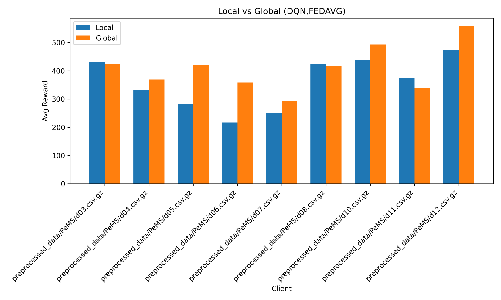
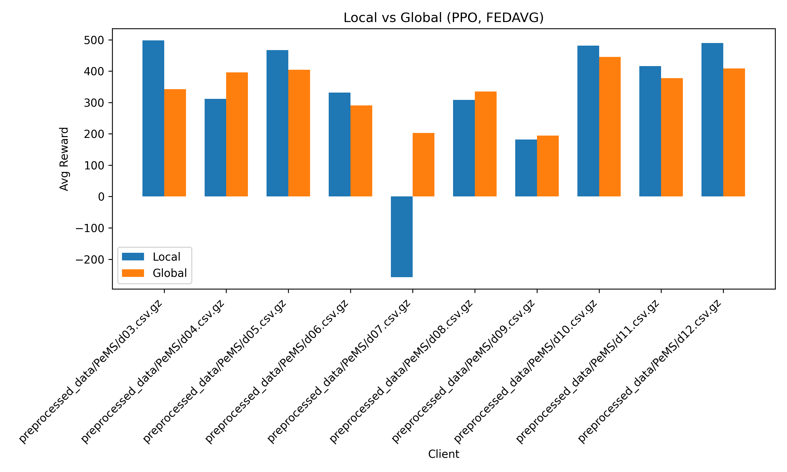
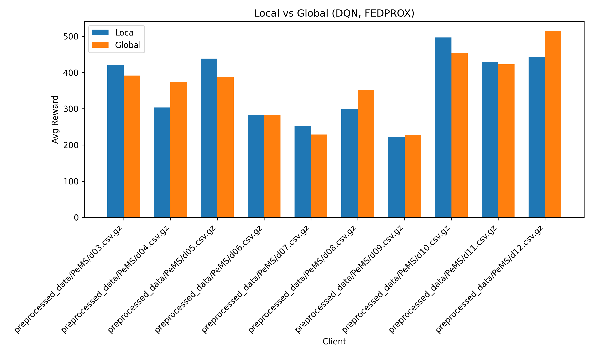
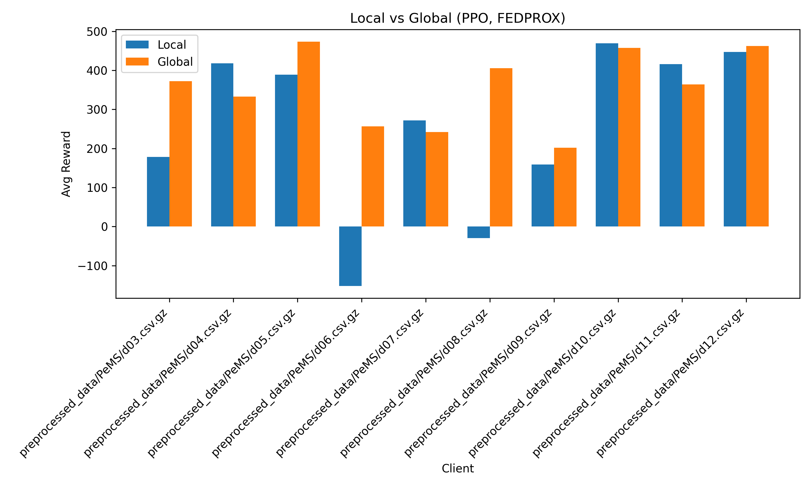

# Federated Learning for Smart Traffic Lights

Modern urban traffic management heavily relies on outdated centralized systems with fixed timers or centralized AI models requiring extensive data collection. These approaches struggle to adapt to dynamic, region-specific traffic conditions, leading to inefficiencies, privacy concerns, and scalability challenges. This project addresses these limitations by leveraging Reinforcement Learning (RL), specifically Deep Q-Networks (DQN) and Proximal Policy Optimization (PPO), to optimize local traffic signals using real-time traffic data from the PeMS dataset.

We then integrate these models into a Federated Learning (FL) framework to collaboratively train a global policy across heterogeneous traffic environments—without exchanging raw data. This decentralized approach enables adaptive, scalable, and privacy-preserving traffic signal control.

---

## Overview

- Utilizes PeMS district-level traffic data (flow, occupancy, speed) for simulation.
- Implements RL agents (DQN and PPO) for optimizing signal decisions.
- Supports standalone training and federated learning across clients.
- Aggregates models using FedAvg or FedProx.
- Visualizes performance comparison between local and global models.

---

## Setup

Install required packages:
```bash
pip install torch numpy matplotlib pandas
```

Prepare your PeMS-formatted traffic data (CSV or .csv.gz files), organized by client.

---

## Local Model Training

To train a new DQN agent locally:
```bash
python3 main_pems_dqn.py --data preprocessed_data/PeMS --mode train --episodes 50 --steps 200
```

To evaluate a trained agent:
```bash
python3 main_pems_dqn.py --data preprocessed_data/PeMS --mode eval --weights weights/dqn_traffic_50.pth --eval_episodes 5
```

For PPO agent, replace script with:
```bash
python3 main_pems_ppo.py ...
```

---

## Federated Learning

We support FL using both DQN and PPO agents with either `FedAvg` or `FedProx`.

### Run Federated Training
```bash
python3 federated_main.py \
  --algo ppo \
  --strategy fedavg \
  --clients preprocessed_data/PeMS \
  --rounds 3 \
  --episodes 100 \
  --eval_episodes 10 \
  --steps 288
```

### Load and Evaluate a Pretrained Global Model
```bash
python3 federated_main.py \
  --algo dqn \
  --strategy fedprox \
  --clients preprocessed_data/PeMS \
  --global_model results/global_dqn_fedprox.pth \
  --eval_episodes 10 \
  --steps 288
```

---

## Command Line Arguments

| Argument        | Description                              |
|----------------|------------------------------------------|
| `--algo`        | Algorithm: `dqn` or `ppo`                |
| `--strategy`    | Aggregation: `fedavg` or `fedprox`       |
| `--clients`     | Path to individual CSVs or a directory   |
| `--rounds`      | Number of FL rounds                      |
| `--episodes`    | Episodes per client per round            |
| `--eval_episodes` | Evaluation episodes per client         |
| `--steps`       | Max steps per episode                    |
| `--mu`          | Proximal term (for FedProx, default=0.1) |
| `--global_model`| Load a pretrained model for evaluation   |

---

## Project Structure

```
├── federated_main.py       # Federated learning orchestration
├── main_pems_dqn.py        # Standalone training/eval for DQN
├── main_pems_ppo.py        # Standalone training/eval for PPO
├── traffic_dqn_agent.py    # Dueling DQN agent implementation
├── traffic_ppo_agent.py    # PPO agent with actor-critic model
├── pems_traffic_env.py     # PeMS traffic simulation environment
├── fl_utils.py             # Aggregation strategies: FedAvg, FedProx
├── preprocessed_data/      # Input data for each district
├── weights/                # Saved local/global models
├── results/                # Evaluation plots and comparison graphs
```

---

## Results

We evaluated four combinations across 10 PeMS clients. The results show:

- **DQN + FedProx**: Consistently outperforms local baselines.
- **PPO + FedProx**: Highest gains in heterogeneous traffic (e.g., d08).
- **FedAvg**: Effective in IID-ish settings but less stable under divergence.

<p align="center">
  <br>
  <em>DQN with FedAvg</em>
</p>

<p align="center">
  <br>
  <em>PPO with FedAvg</em>
</p>

<p align="center">
  <br>
  <em>DQN with FedProx</em>
</p>

<p align="center">
  <br>
  <em>PPO with FedProx</em>
</p>

---

## Future Work

- Implement privacy-preserving FL (e.g., differential privacy).
- Add support for hierarchical FL across multiple layers.
- Integrate SUMO for real-world traffic simulation.
- Extend to multi-agent coordination and intersection-level routing.
